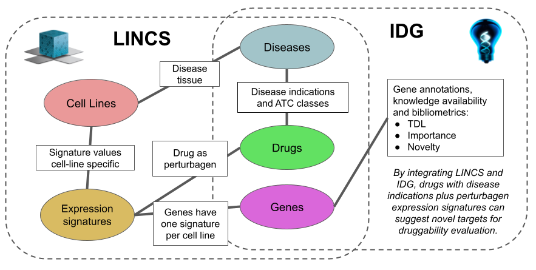
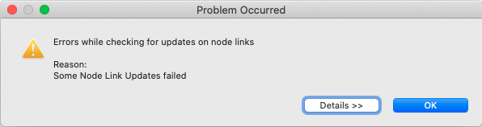
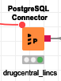

# `kgap_lincs-idg`

Knowledge graph analytics platform (KGAP) for LINCS and IDG Common Fund dataset integration.
The initial biomedical application is Parkinson's disease drug target discovery, in alignment
with the IDSL __PRIDE__ initiative (Parkinson's Research through Integrative Data Experiments).

See also:

* [KGAP Project Homepage](http://cheminfov.informatics.indiana.edu/projects/kgap/)

## Publication  (in preparation)

"Knowledge graph analytic platform with LINCS and IDG for Parkinson's disease target illumination",
by Jeremy J Yang, Christopher R Gessner, Joel L Duerksen, Brian Foote, Daniel Biber,
Jessica L Binder, Robin McEntire, Kyle Stirling, Ying Ding and David J Wild.



## Graph database

### Dependencies for fast path
- Neo4j Version 4.2 (plugin version automatically determined by Neo4j version)
- 8GB+ ram
- 5GB+ free disk space
- datasets listed

### additional dependencies for long path
- Knime Version 4.3 (will notify for automatic download any nodes required but not yet installed)
- ability to run, load from dump and host temporarily Postgres 10.11 database

### The fast path
Note: These steps should work with little or no modifications on Macintosh, Unix, and Windows. Process was tested on a MacBookPro 2017 running MacOS Catalina

To restore this graph database from a dump file download
this [dump file](http://cheminfov.informatics.indiana.edu/projects/kgap/data/dclneodb.dump),
install the Neo4j Desktop Client [Neo4j](https://neo4j.com/) and launch it.  
Create a new 4.2 database (do not start the database).  Now click on the *...* and then click *Manage* in the pop up menu, and then click on *Open Terminal*. 
Now to restore the database from the dump file use the command (change *pathtofile* accordingly first)
```
  bin/neo4j-admin load --from=pathtofile/dclneodb.dump --database=neo4j
```
now exit the terminal, click *Start* to start the database
Now click *Open* to use built in neo4j browser to query and explore the database

### The long path (and more technical), to recreate the graph database from source datasets
#### Step 1: create node and relationship files 
Note: Developed and used on Ubuntu 20.04, and then these directions were tested on a MacbookPro 2017 running MacOS Catalina 

- Clone this repository in your home directory, the following process assumes ~/kgap_lincs-idg/ exists and is populated
- Download, restore and bring online [drugcentral_lincs](http://cheminfov.informatics.indiana.edu/projects/kgap/data/drugcentral_lincs.pgdump)
- Download and install [Knime](https://www.knime.com/) Note: The workflow was created with version 4.3
- Import the knime workflow [kgap_lincs-idg/opt1_step1_create_neo4j_files](opt1_step1_create_neo4j_input_files/drugcentral_lincs_etl2neo4jfiles.knwf), you will see and safely ignore this dialog message <BR>
- This workflow extracts and transforms data from three datasets, the file [tcrd_targets.tsv](opt1_step1_create_neo4j_input_files/tcrd_targets.tsv) in this repository, the online  database, and the drugcentral_lincs database (loaded above)
- In the knime workflow find the drugcentral_lincs PostgresSQL Connector  and change the address/port to point to the drugcentral_lincs database where you are hosting it
- In Knime "Excecute all executable nodes" for this workflow, the relationship and node files (and the header files) will be stored in opt1_step2_docker_neo4j_load/e and opt1_step2_docker_neo4j_load/v respectively.  The script opt1_step2_docker_neo4j_load/clean_ev is a utility script to delete the relationship and node files.  (note: the contents of these two directories are ignored by git)
#### Step 2: load relationships and nodes into Neo4j 
  - An example script to load in neo4j community server running in docker are provided in [opt1_step2_docker_neo4j_load](opt1_step2_docker_neo4j_load)
